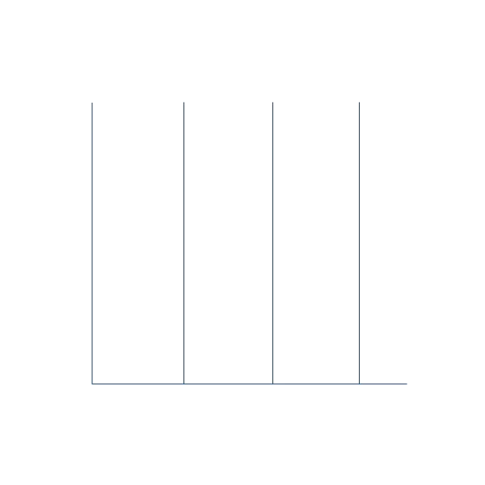

  

<h1 align="center">Hi 👋, I'm Menath Nadungoda</h1>
<h3 align="center">Welcome to My Corner of the Digital World! I'm a Passionate UI Developer Dedicated to Creating Visually Stunning and User-Friendly Experiences.</h3>

  <h2>👀 GitHub Profile View Counter:</h2>
  

    
  

  <h2>🎟️ Visitor Count Card:</h2>
  

    
  

  <h2>💫 About Me:</h2>
  
<h3>🌱 I’m currently learning <strong>React & Figma</strong></h3>

  
<h3>💬 Ask me about <strong>UI Design</strong></h3>

  
<h3>📫 How to reach me: <strong>nadungmenath1@gmail.com</strong></h3>

  
<h3>⚡ Fun fact: <strong>UI developers are like digital architects, sculpting pixels and code to create seamless user experiences that feel as good as they look! 🎨💻</strong></h3>

  <h2 align="center"> Connect With Me 🤝: </h2>
  

    &#160;&#160;&#160;
    &#160;&#160;&#160;
    &#160;&#160;&#160;
    &#160;&#160;&#160;
    &#160;&#160;&#160;
    &#160;&#160;&#160;
    &#160;&#160;&#160;
    &#160;&#160;&#160;
  

  <h2>🛠️ Tech Stack:</h2>
  

    &#160;&#160;&#160;
    &#160;&#160;&#160;
    &#160;&#160;&#160;
    &#160;&#160;&#160;
    &#160;&#160;&#160;
    &#160;&#160;&#160;
    &#160;&#160;&#160;
    &#160;&#160;&#160;
    &#160;&#160;&#160;
    &#160;&#160;&#160;
    &#160;&#160;&#160;
    &#160;&#160;&#160;
    &#160;&#160;&#160;
    &#160;&#160;&#160;
    &#160;&#160;&#160;
    &#160;&#160;&#160;
    &#160;&#160;&#160;
    &#160;&#160;&#160;
    &#160;&#160;&#160;
    &#160;&#160;&#160;
    &#160;&#160;&#160;
    &#160;&#160;&#160;
    &#160;&#160;&#160;
    &#160;&#160;&#160;
    &#160;&#160;&#160;
    &#160;&#160;&#160;
    &#160;&#160;&#160;
    &#160;&#160;&#160;
    &#160;&#160;&#160;
    &#160;&#160;&#160;
    &#160;&#160;&#160;
    &#160;&#160;&#160;
    &#160;&#160;&#160;
    &#160;&#160;&#160;
    &#160;&#160;&#160;
    &#160;&#160;&#160;
    &#160;&#160;&#160;
    &#160;&#160;&#160;
    &#160;&#160;&#160;
  

  <h2>👽 My Profile Stats:</h2>

  

 

 

  

 

  <a href="https://github.com/MenathNDGD">
    
    &#160;&#160;&#160;
    
  </a>

 

  <a href="https://github.com/MenathNDGD">
    
    &#160;&#160;&#160;
    
  </a>

 

  

  <h2>🏆 GitHub Trophies:</h2>
  

    
  

  <h2>✍️ Random Dev Quote:</h2>
  

    
  

  <h2>🔝 Top Contributed Repo:</h2>
  

    
  

  <h2>📈 GitHub Activity Graph:</h2>
  

    
  

